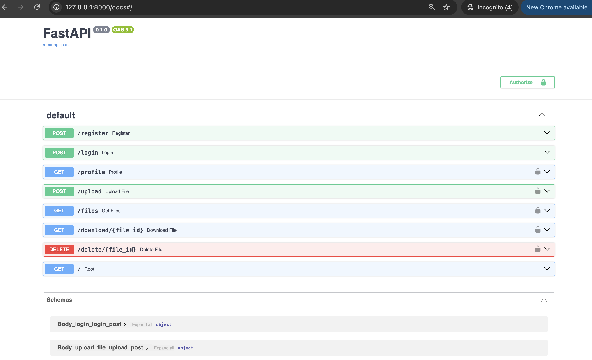
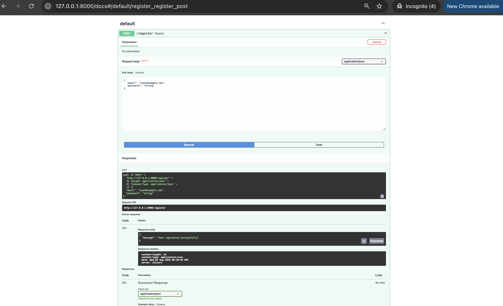
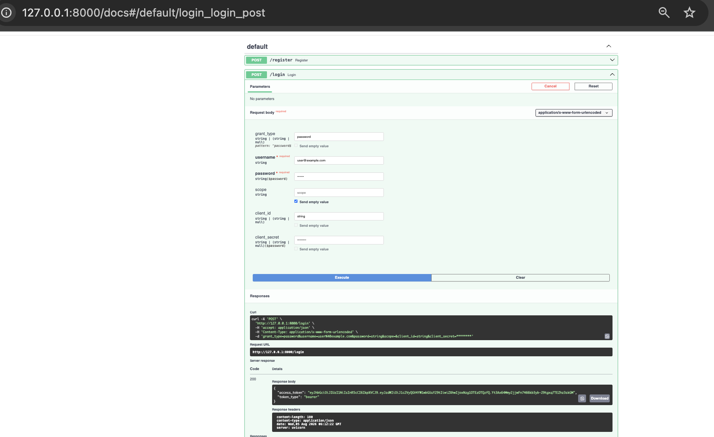
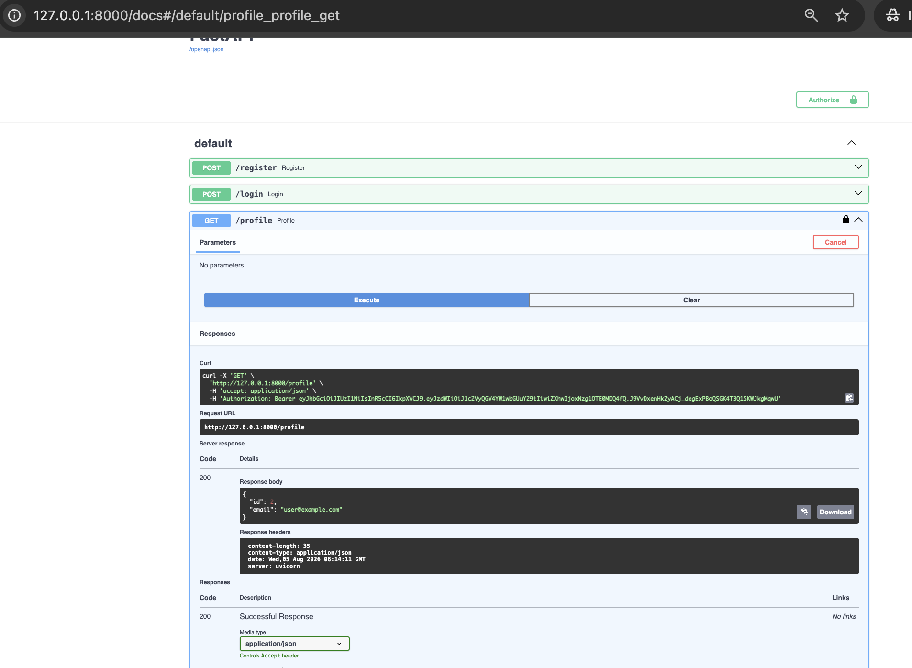
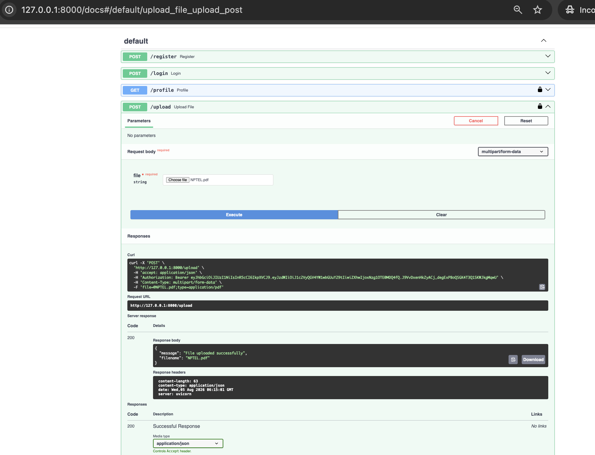
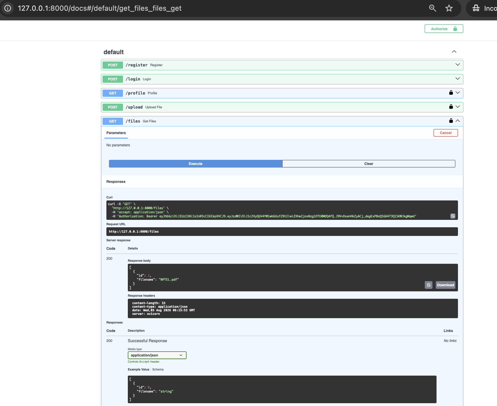
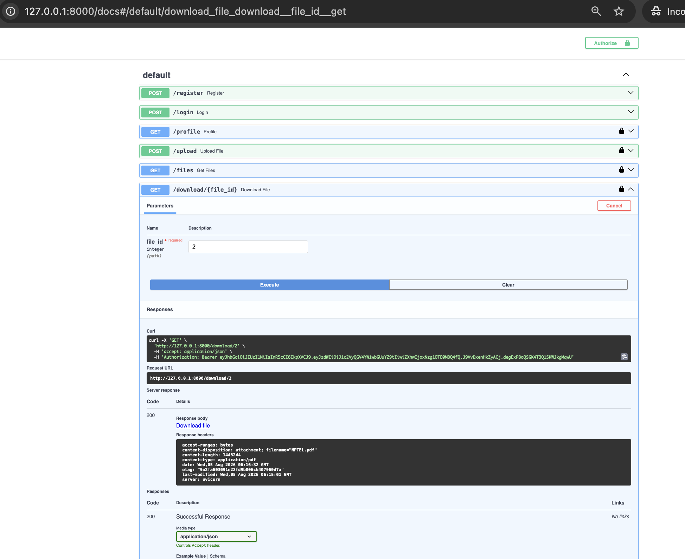
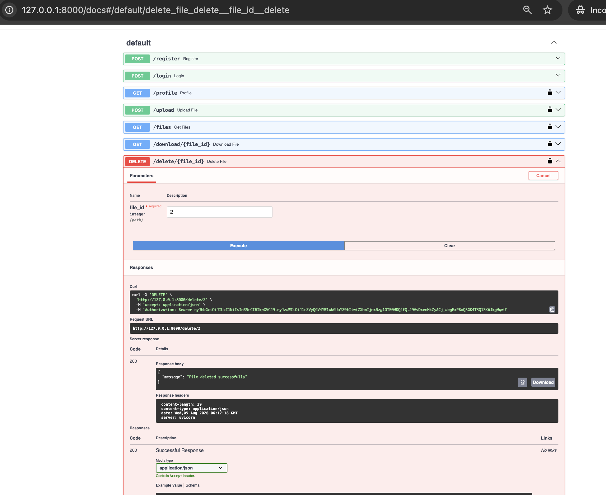

<div align="center">

# 🔐 Secure File Management API

### A Secure REST API for User Authentication & File Management using FastAPI

Upload • Download • Delete • JWT Authentication • SQLAlchemy • SQLite


</div>

---

# 📖 About the Project

Secure File Management API is a RESTful backend application built with **FastAPI** that demonstrates secure authentication and file handling.

Authenticated users can upload, view, download, and delete their own files while ensuring complete access isolation through JWT-based authentication.

This project demonstrates backend development best practices, including JWT-based authentication, secure password hashing, SQLAlchemy ORM, RESTful API design, CRUD operations, database relationships, and secure file management using FastAPI.

---

# ✨ Key Features

### 👤 User Authentication

- Register new users
- Secure login
- Password hashing
- JWT access tokens
- Protected API endpoints

### 📂 File Management

- Upload files
- View uploaded files
- Download files
- Delete files
- Store metadata in database

### 🔒 Security

- JWT Authentication
- Password Hashing
- Protected Routes
- Ownership Verification
- User Isolation
- Secure File Access

### 📖 Developer Friendly

- Interactive Swagger UI
- Automatic OpenAPI Documentation
- Easy API Testing

---

# 🏗️ System Architecture

```
                   Client
                      │
                      ▼
              FastAPI REST API
                      │
        ┌─────────────┴─────────────┐
        ▼                           ▼
 JWT Authentication         File Management
        │                           │
        ▼                           ▼
    SQLite Database          uploads/
```

---

# 🛠️ Tech Stack

| Category | Technology |
|----------|------------|
| Language | Python 3 |
| Framework | FastAPI |
| Database | SQLite |
| ORM | SQLAlchemy |
| Authentication | JWT |
| Password Security | Passlib (bcrypt) |
| API Documentation | Swagger UI |
| ASGI Server | Uvicorn |

---

# 📂 Project Structure

```
fastapi-backend/
│
├── images/
│   ├── swagger.png
│   ├── register.png
│   ├── login.png
│   ├── profile.png
│   ├── upload.png
│   ├── files.png
│   ├── download.png
│   └── delete.png
├── app/
│   ├── database/
│   │   └── database.py
│   │
│   ├── models/
│   │   ├── user.py
│   │   └── file.py
│   │
│   ├── routers/
│   │   ├── auth.py
│   │   └── files.py
│   │
│   ├── schemas/
│   │   ├── user.py
│   │   └── file.py
│   │
│   ├── utils/
│   │   └── auth.py
│   │
│   └── main.py
│
├── uploads/
├── requirements.txt
├── .env
└── README.md
```

---

# 🚀 Getting Started

## Clone Repository

```bash
git clone https://github.com/SamyuktaMenon/osdag-secure-login-system.git
cd osdag-secure-login-system
```

---

## Create Virtual Environment

```bash
python -m venv venv
```

---

## Activate Environment

### Windows

```bash
venv\Scripts\activate
```

### macOS/Linux

```bash
source venv/bin/activate
```

---

## Install Dependencies

```bash
pip install -r requirements.txt
```

---

## Run the Server

```bash
uvicorn app.main:app --reload
```

Server

```
http://127.0.0.1:8000
```

Swagger Documentation

```
http://127.0.0.1:8000/docs
```

ReDoc Documentation

```
http://127.0.0.1:8000/redoc
```

---

# 🔐 Authentication Flow

```text
Register User
      │
      ▼
Login
      │
      ▼
Receive JWT Access Token
      │
      ▼
Authorize in Swagger
      │
      ▼
Access Protected APIs
```

---

# 📌 REST API Endpoints

| Method | Endpoint | Description | Access |
|----------|------------------------|--------------------------|-----------|
| POST | `/register` | Register a new user | 🌐 Public |
| POST | `/login` | Authenticate user | 🌐 Public |
| GET | `/profile` | Retrieve current user | 🔒 Protected |
| POST | `/upload` | Upload a file | 🔒 Protected |
| GET | `/files` | List uploaded files | 🔒 Protected |
| GET | `/download/{file_id}` | Download a file | 🔒 Protected |
| DELETE | `/delete/{file_id}` | Delete a file | 🔒 Protected |

---


# 📸 Screenshots

## 🔹 Swagger UI



---

## 🔹 User Registration



---

## 🔹 User Login



---

## 🔹 User Profile



---

## 🔹 Upload File



---

## 🔹 List Uploaded Files



---

## 🔹 Download File



---

## 🔹 Delete File



---

# 🧪 Example Workflow

1. Register a new user.
2. Login and obtain a JWT token.
3. Authorize using the Swagger UI.
4. Upload one or more files.
5. Retrieve uploaded files.
6. Download files using the file ID.
7. Delete files when no longer required.

---

# 📈 Future Improvements

- PostgreSQL Integration
- AWS S3 Storage
- Docker Support
- Docker Compose
- File Size Validation
- File Type Restrictions
- Refresh Tokens
- Role-Based Access Control (RBAC)
- Email Verification
- Unit & Integration Testing
- CI/CD Pipeline using GitHub Actions

---

# 🎯 Learning Outcomes

This project demonstrates proficiency in:

- REST API Development
- FastAPI Framework
- SQLAlchemy ORM
- JWT Authentication
- Secure Backend Development
- CRUD Operations
- File Handling in Python
- Database Relationships
- API Documentation
- Authentication & Authorization

---

# 👩‍💻 Author

**Samyukta Menon**

B.Tech Computer Science Engineering  
VIT Bhopal University

**GitHub**  
https://github.com/SamyuktaMenon

**LinkedIn**  
https://www.linkedin.com/in/samyuktamenon/

---

